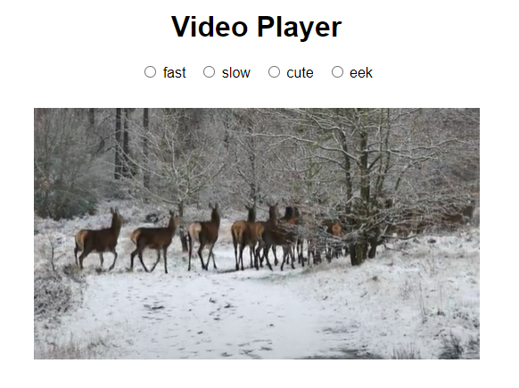

# Video Player App

This project was created with three components to work together to make a responsive video player.

On each radio button click, the video player will update the playing video. Give it a go.

## Available Scripts

In the project directory, you can run:

### `yarn start`

Runs the app in the development mode.\
Open [http://localhost:3000](http://localhost:3000) to view it in your browser.

